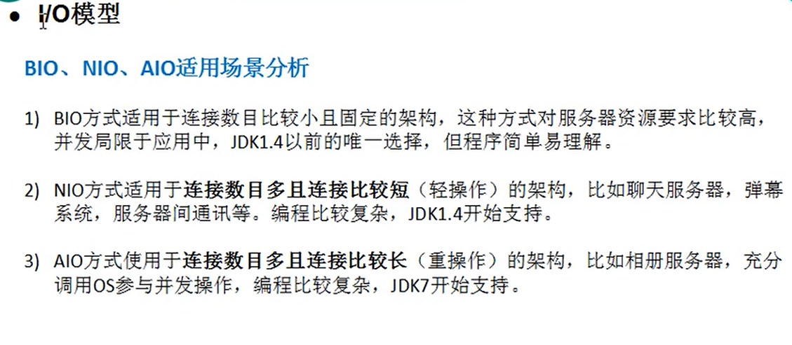
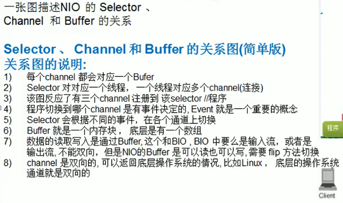
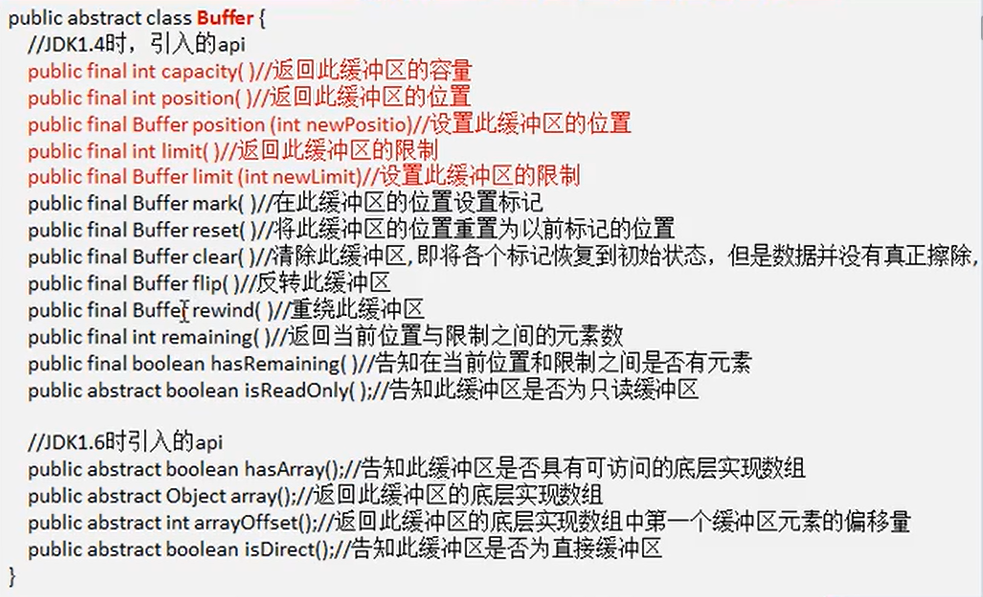
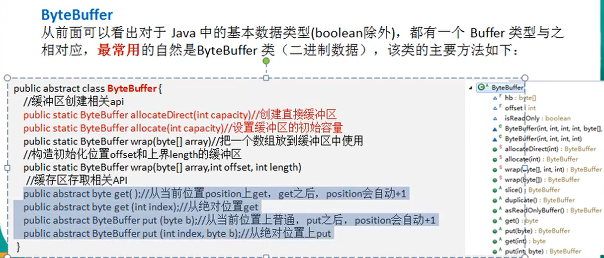

# netty学习记录

## BIO
缺点：
1. 并发较大的时候需要创建大量的线程
2. 没有数据传输的时候线程会闲置阻塞，浪费资源  

## NIO
nio实现非阻塞的核心为Buffer，通过缓冲区缓冲，


### buffer读写
```
public final Buffer flip() {
        limit = position;
        position = 0;
        mark = -1;
        return this;
    }
```
## Buffer
常见方法

### ByteBuffer
buffer中最常用的为ByteBuffer,其中最常见的方法有如下：
