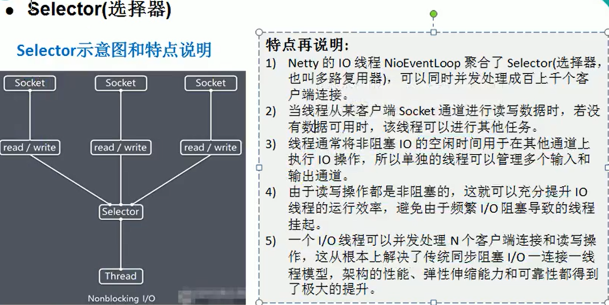
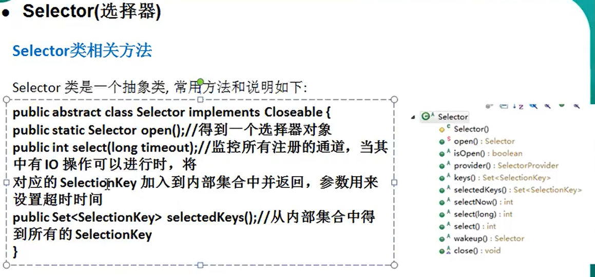
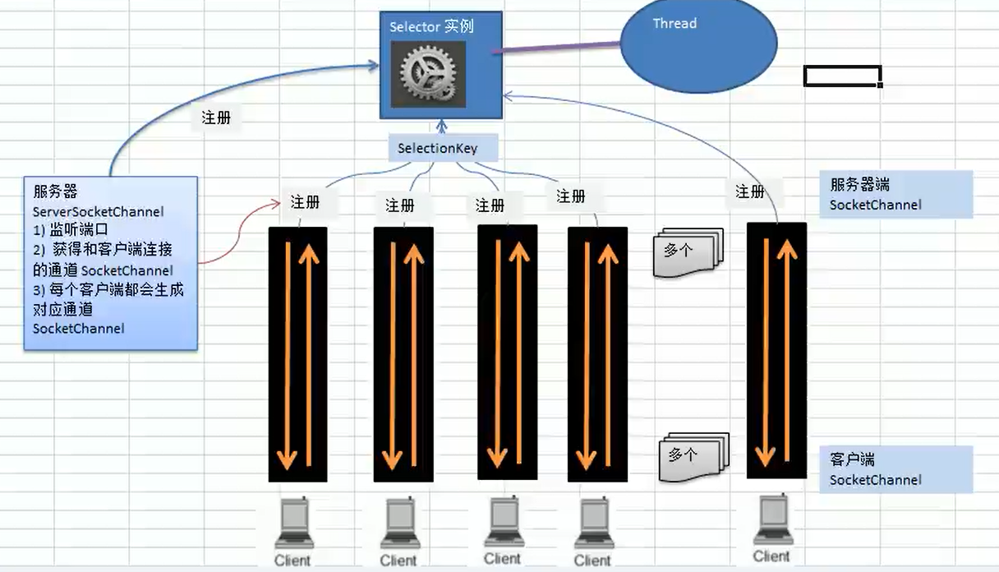

# netty学习记录

## 1. BIO
缺点：
1. 并发较大的时候需要创建大量的线程
2. 没有数据传输的时候线程会闲置阻塞，浪费资源  

## 2. NIO
nio实现非阻塞的核心为Buffer，通过缓冲区缓冲，


### Buffer
#### buffer读写
```
public final Buffer flip() {
        limit = position;
        position = 0;
        mark = -1;
        return this;
    }
```
常见方法

#### ByteBuffer
buffer中最常用的为ByteBuffer,其中最常见的方法有如下：


### Selector

#### 其常用方法如下:

#### selector及selectionKey等关系


#### NIOServer NIOClinet demo
服务端: com.fh.nio.NIOServer
客户端: com.fh.nio.NIOClient

#### NIO群聊
服务端: com.fh.nio.GroupChatServer
客户端: com.fh.nio.GroupChatClient